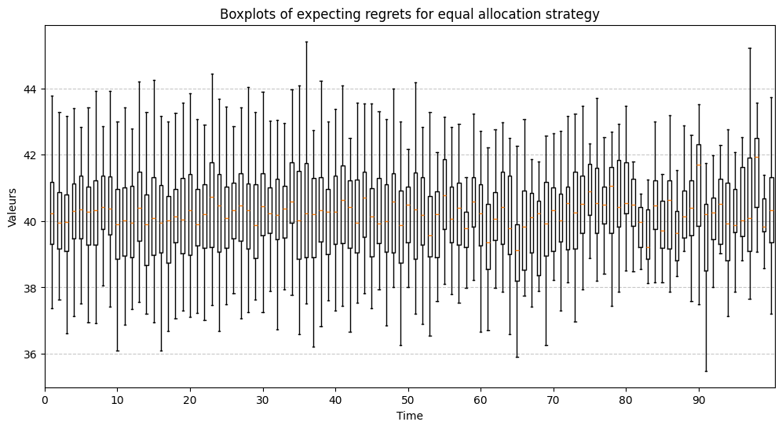
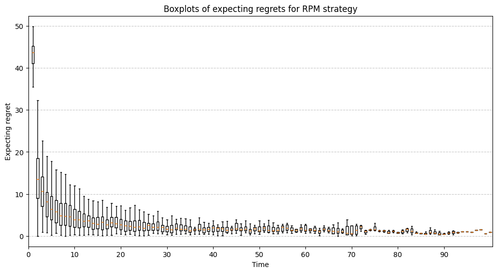
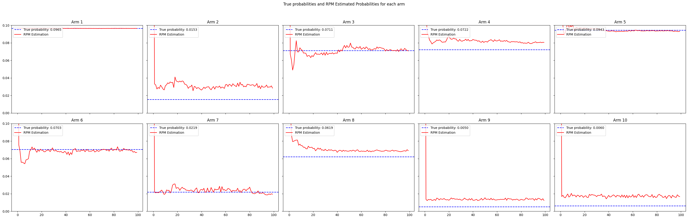
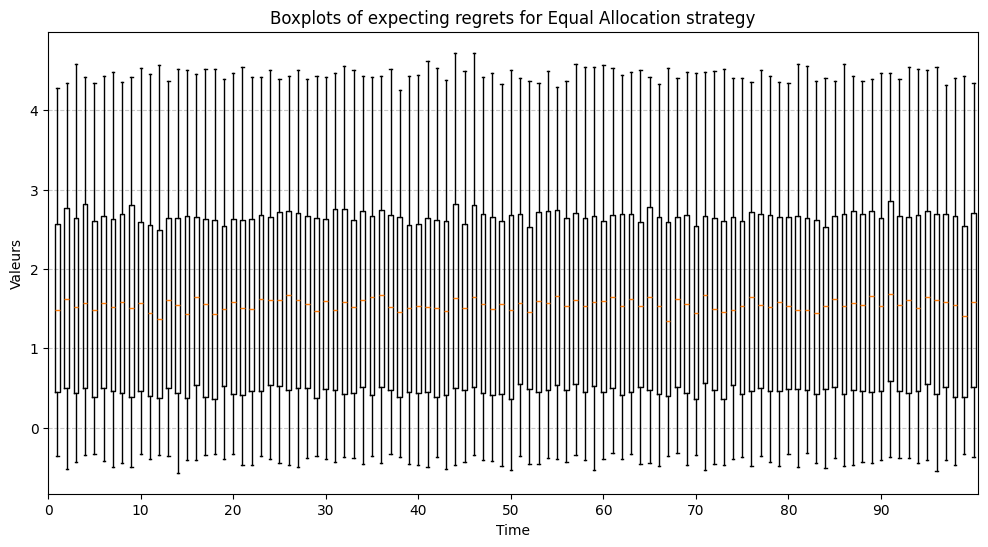
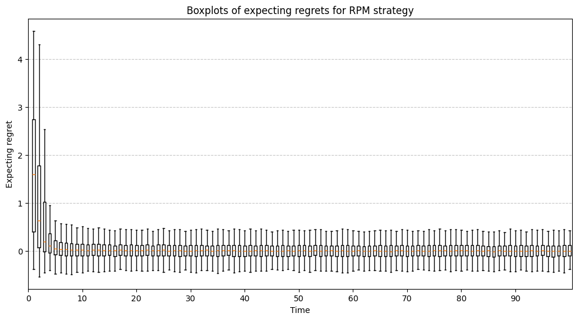

# A Bayesian Modern Look at Multi-Armed Bandits

## Project Overview

This project explores the **multi-armed bandit problem** using **Bayesian methods**, specifically focusing on the **Randomized Probability Matching (RPM)** algorithm. The work aims to demonstrate how Bayesian approaches balance the trade-off between exploration and exploitation, minimizing regret and converging to optimal decisions efficiently.

This project was developed collaboratively by:
- **Charlotte De Romémont** ([charlotte.deromemont@ensae.fr](mailto:charlotte.deromemont@ensae.fr))
- **Suzie Grondin** ([suzie.grondin@ensae.fr](mailto:suzie.grondin@ensae.fr))
- **Marion Chabrol** ([marion.chabrol@ensae.fr](mailto:marion.chabrol@ensae.fr))

---

## Key Concepts

- **Multi-Armed Bandit Problem**: A sequential decision-making scenario aiming to maximize cumulative rewards from unknown payoff distributions.
- **Randomized Probability Matching (RPM)**: A Bayesian algorithm that assigns probabilities to each arm based on posterior distributions, enabling efficient exploration and exploitation.

---

## Implementation

The implementation consists of:

1. **Binomial Bandits**:
   - Models arms with binary outcomes (success/failure).
   - Uses posterior Beta distributions to estimate arm probabilities.
   - Visualizations demonstrate how RPM quickly converges to optimal arms while minimizing regret.

2. **Linear Bandits**:
   - Generalizes bandits to continuous outcomes using regression models.
   - Explores the impact of structured environments and evaluates RPM's performance under linear assumptions.

---

## Repository

Find the code and notebooks in our [GitHub repository](https://github.com/mchabrol/Bayesian-Statistics-).

### Key Files:
- `Binomial_Bandits.ipynb`: Code and experiments for binomial bandits.
- `Linear_Bandits.ipynb`: Implementation of linear bandits with RPM.

---

## Results

- **Binomial Bandits**:
  - RPM outperforms equal allocation by minimizing cumulative regret.
  - Faster convergence for arms with higher success probabilities.
  
- **Linear Bandits**:
  - Demonstrates robust performance in environments with structured action spaces.
  - Efficient handling of exploration and exploitation, even with noisy data.

---

## Visualization











---

## Installation and Usage

### Prerequisites
- Python 3.x
- Required libraries: `numpy`, `scipy`, `matplotlib`, `pandas`

### How to Run
1. Clone the repository:
   ```bash
   git clone https://github.com/mchabrol/Bayesian-Statistics-.git

2. Run the notebooks `Binomial_Bandits.ipynb` and `Linear_Bandits.ipynb` sequentially.

